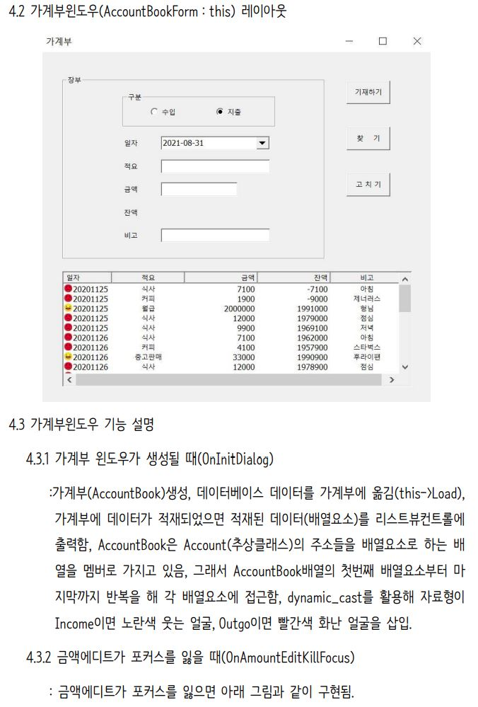
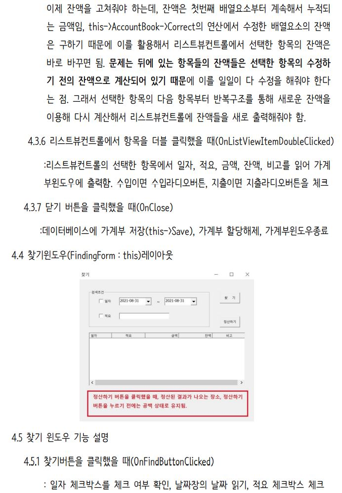
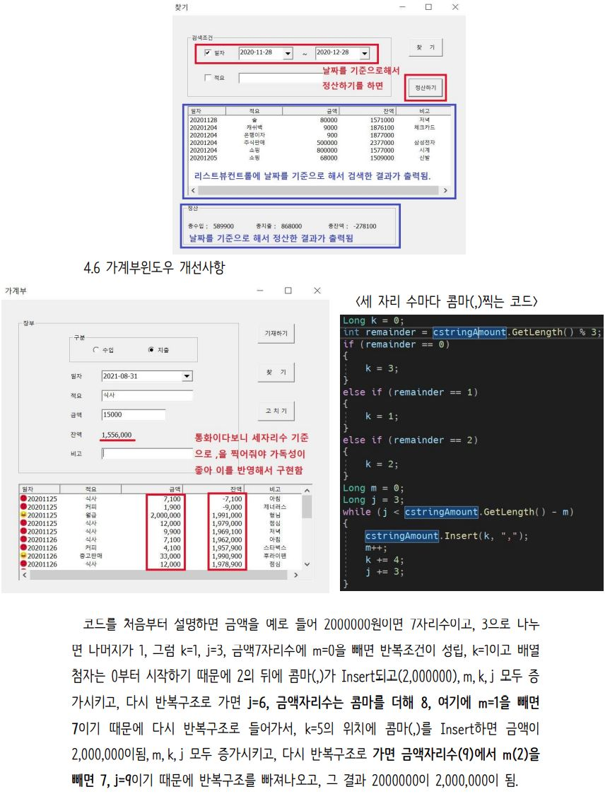

# 가계부(AccountBook) 프로그램입니다.
## 자바로 가계부 프로그램을 구현하면서 정리한 내용을 개인 블로그에 올렸습니다.
<a href="https://injae7034.github.io/java/twentieth/" target="_blank">Java프로젝트하면서 추상클래스, 추상메소드, 다형성, 부모와 자식간의 상속 개념 배우기</a>  
<a href="https://injae7034.github.io/java/twentyFirst/" target="_blank">Java프로젝트하면서 오버로딩 그리고 다형성, 오버라이딩을 적용하여 코드 효율성 올리기</a>  
<a href="https://injae7034.github.io/java/twentySecond/" target="_blank">반환값이 여러개인 C++의 메소드를 Java에서 HashMap을 적용하여 반환값 1개인 메소드로 바꾸기</a>  
## C++로 가계부 프로그램을 구현한 내용을 요약하였습니다.

