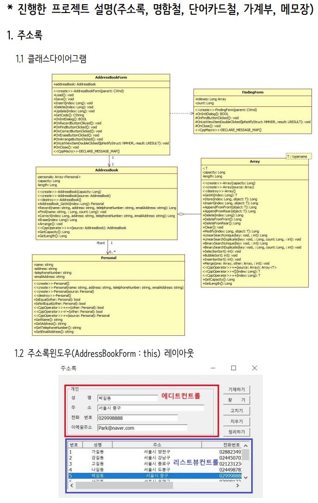
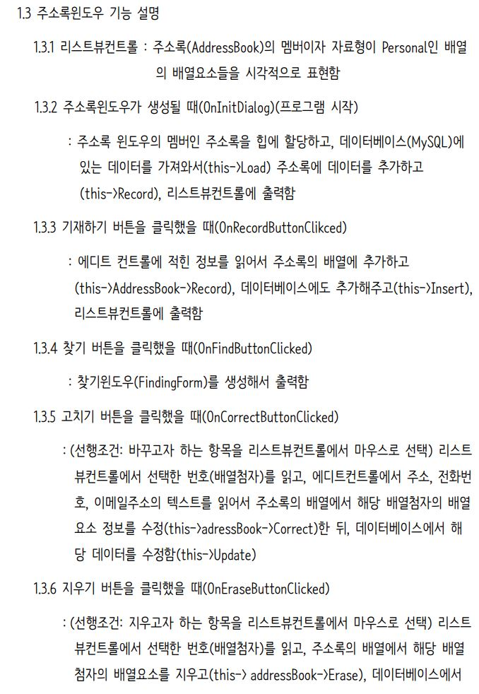
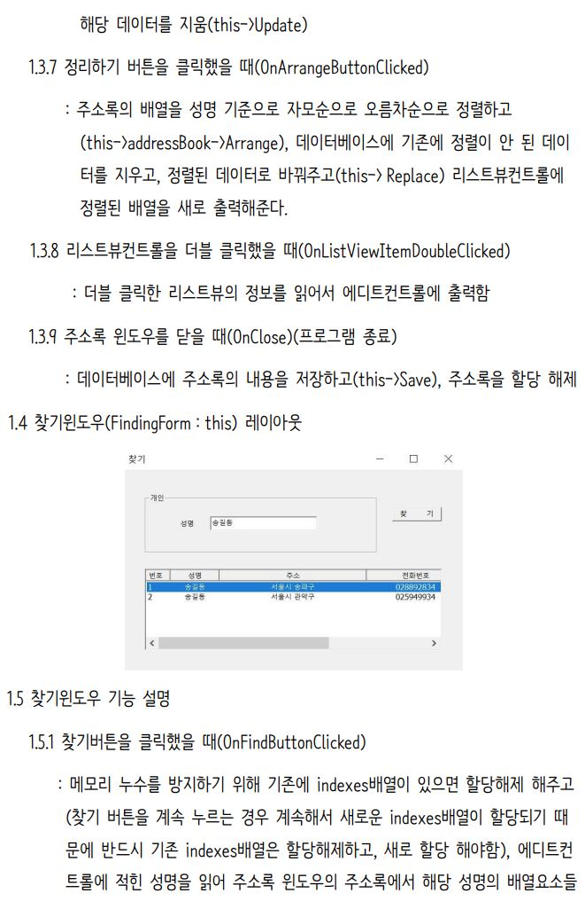
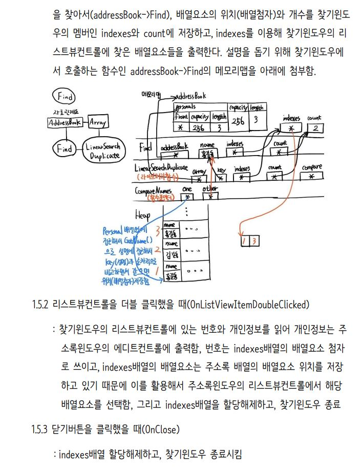

# 주소록(AddressBook)프로그램입니다.
## C++로 주소록 프로그램을 구현한 내용을 요약하였습니다.

## C++로 구현한 주소록 프로그램을 자바로 구현하면서 정리한 내용을 개인 블로그에 올렸습니다.
<a href="https://injae7034.github.io/java/ninth/" target="_blank">주소록 구현하면서 String의 특성으로 인한 깊은 복사 설명하기</a>  
<a href="https://injae7034.github.io/java/tenth/" target="_blank">주소록 구현하면서 ArrayList의 얕은 복사 깊은 복사 설명하기</a>  
<a href="https://injae7034.github.io/java/twelveth/" target="_blank">주소록 구현하면서 문자열 특화 입출력인 Reader/Writer클래스 사용하기 및 CUI 프로그래밍</a>  
<a href="https://injae7034.github.io/java/thirteenth/" target="_blank">주소록 구현하면서 데이터베이스 개념 적용 및 MySQL과 연동시키기</a>  
